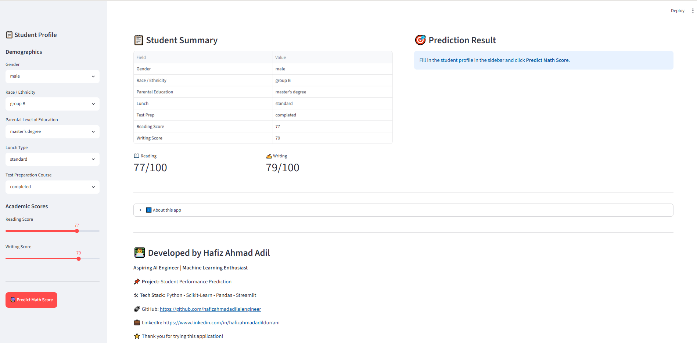
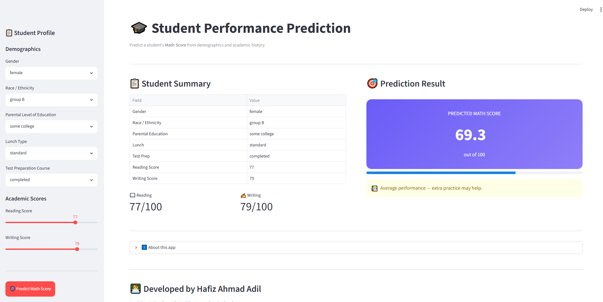

# 🎓 Student Performance Prediction using Machine Learning


## 📌 Project Overview

This project predicts a student's **Math Score** based on demographic information and academic performance using Machine Learning.

The application allows users to enter student details through a Streamlit web interface and receive an instant prediction.

---

## 🚀 Live Demo

*(Add your Streamlit link after deployment)*

```
https://your-streamlit-app.streamlit.app
```

---

# Dataset

**Student Performance Dataset**

- 1000 student records
- Reading Score
- Writing Score
- Gender
- Race/Ethnicity
- Lunch Type
- Test Preparation Course
- Parental Level of Education

Dataset Source:

https://www.kaggle.com/datasets/spscientist/students-performance-in-exams

---

# Features

- Exploratory Data Analysis (EDA)
- Data Cleaning
- Outlier Analysis
- One-Hot Encoding
- Feature Scaling
- Model Training
- Model Evaluation
- Streamlit Web Application

---

# Machine Learning Models

- Linear Regression ✅
- Decision Tree Regressor
- Random Forest Regressor

**Best Model:** Linear Regression

---

# Tech Stack

- Python
- Pandas
- NumPy
- Matplotlib
- Seaborn
- Scikit-Learn
- Joblib
- Streamlit

---

# Project Structure

```
02-student-performance-prediction/
│
├── data/
├── models/
├── notebooks/
├── outputs/
├── screenshots/
├── src/
├── app.py
├── requirements.txt
└── README.md
```

---

# Model Workflow

1. Load Dataset
2. Perform EDA
3. Preprocess Data
4. One-Hot Encode Categorical Features
5. Scale Numerical Features
6. Train Multiple Models
7. Evaluate Models
8. Save Best Model
9. Deploy with Streamlit

---

# Screenshots

## Home Page



## Prediction



---

# Future Improvements

- Hyperparameter Tuning
- XGBoost
- LightGBM
- Cross Validation
- Docker Deployment
- CI/CD Pipeline

---

# Author

**Hafiz Ahmad Adil**

- GitHub: https://github.com/hafizahmadadilaiengineer
- LinkedIn: https://www.linkedin.com/in/hafizahmadadildurrani

---

⭐ If you like this project, don't forget to star the repository.