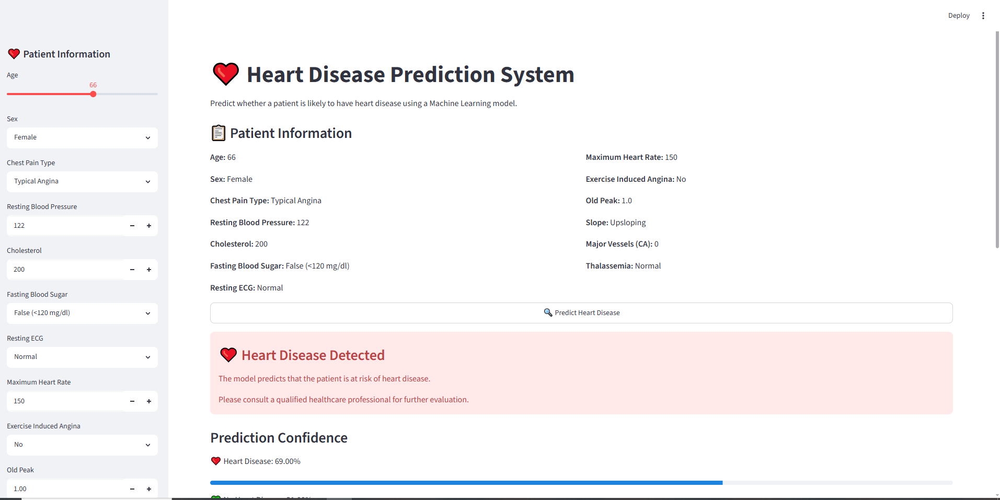
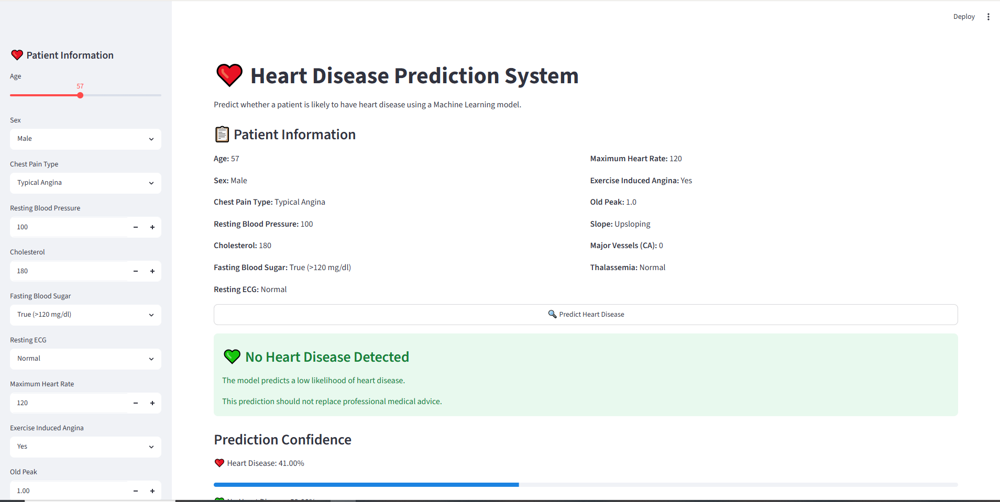
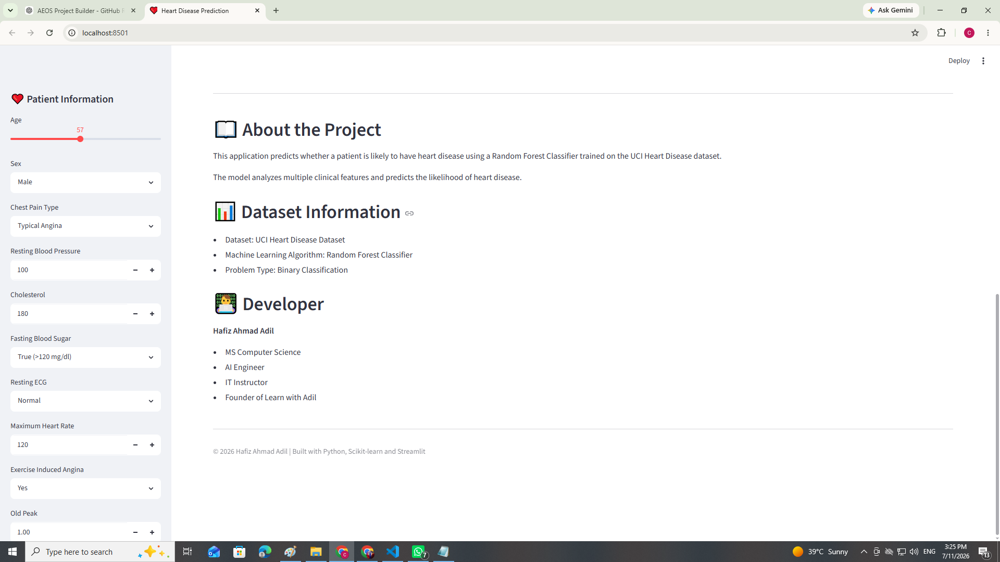

# ❤️ Heart Disease Prediction System

An end-to-end Machine Learning project that predicts whether a patient is likely to have heart disease using clinical attributes. The project follows a complete Machine Learning workflow including Exploratory Data Analysis (EDA), Data Preprocessing, Model Training, Model Evaluation, and Deployment with Streamlit.

---

## 📌 Project Overview

Heart disease is one of the leading causes of death worldwide. Early prediction can help healthcare professionals identify high-risk patients and provide timely treatment.

This project uses Machine Learning algorithms to classify whether a patient has heart disease based on medical information.

---

## 🎯 Problem Statement

Develop a Machine Learning model that accurately predicts whether a patient has heart disease using patient clinical data.

---

## 👥 Target Users

- Healthcare Professionals
- Medical Researchers
- Data Science Students
- Machine Learning Enthusiasts

---

## 📊 Dataset

**Dataset:** UCI Heart Disease Dataset

**Rows:** 1025

**Columns:** 14

**Target Variable**

- 0 → No Heart Disease
- 1 → Heart Disease

---

## ⚙️ Tech Stack

- Python
- Pandas
- NumPy
- Matplotlib
- Seaborn
- Scikit-learn
- Joblib
- Streamlit

---

## 📂 Project Structure

```
03-heart-disease-prediction/
│
├── app.py
├── README.md
├── requirements.txt
├── .gitignore
│
├── data/
│   ├── raw/
│   └── processed/
│
├── models/
│   ├── heart_disease_model.pkl
│   └── scaler.pkl
│
├── notebooks/
│   ├── 01_eda.ipynb
│   ├── 02_preprocessing.ipynb
│   └── 03_model_training.ipynb
│
├── screenshots/
│
└── src/
    ├── train.py
    └── predict.py
```

---

## 🔍 Exploratory Data Analysis

Performed:

- Dataset Exploration
- Class Distribution
- Correlation Analysis
- Outlier Detection
- Feature Distribution

---

## 🧹 Data Preprocessing

- Removed Duplicate Records
- Checked Missing Values
- Feature Scaling using StandardScaler
- Train-Test Split using Stratified Sampling

---

## 🤖 Machine Learning Models

The following models were trained and compared:

- Decision Tree Classifier
- Random Forest Classifier
- K-Nearest Neighbors (KNN)

---

## 🏆 Best Model

**Random Forest Classifier**

The best-performing model was selected based on classification performance.

---

## 🚀 Features

- Predict Heart Disease
- Professional Streamlit Interface
- Human-readable Input Options
- Prediction Confidence
- Patient Information Summary
- About Project Section

---

## 📸 Application Screenshots

### Home Page


---

### Filled Form


---

### Heart Disease Prediction



---

### No Heart Disease Prediction



---

### Prediction Confidence


---

### About Section



---

## ▶️ Installation

Clone the repository

```bash
git clone https://github.com/hafizahmadadilaiengineer/machine-learning-projects.git
```

Go to project folder

```bash
cd 03-heart-disease-prediction
```

Install dependencies

```bash
pip install -r requirements.txt
```

Run the application

```bash
streamlit run app.py
```

---

## 📈 Future Improvements

- Hyperparameter Tuning
- XGBoost Classifier
- LightGBM Classifier
- Feature Importance Visualization
- Model Explainability using SHAP
- Docker Deployment

---

## 👨‍💻 Author

**Hafiz Ahmad Adil**

- MS Computer Science
- AI Engineer
- IT Instructor
- Founder of Learn with Adil

---

## ⭐ If you like this project

Please consider giving this repository a ⭐ on GitHub.