<div align="center">

# 🏦 Smart Loan Approval & Risk Assessment System

### AI-Powered Loan Approval Prediction using Machine Learning, FastAPI & Streamlit

<p align="center">


</p>

---

An end-to-end Machine Learning application that predicts whether a loan application should be **Approved** or **Rejected** using a **Random Forest Classifier**.

The project follows a **production-style architecture** by separating the Machine Learning model from the user interface using **FastAPI**, while providing a professional **Streamlit banking dashboard** for end users.

</div>

---

# 📖 Table of Contents

- Project Overview
- Features
- Technology Stack
- Dataset
- Machine Learning Workflow
- System Architecture
- Project Structure
- Model Performance
- Application Preview
- Exploratory Data Analysis
- Model Evaluation
- API Documentation
- Installation
- Running the Application
- Future Improvements
- Author

---

# 📌 Project Overview

Loan approval is one of the most important decisions made by financial institutions. Traditional manual evaluation is often slow, inconsistent, and prone to human bias.

The **Smart Loan Approval & Risk Assessment System** automates this process using Machine Learning. It evaluates applicant information—including annual income, credit score, employment status, loan amount, and asset values—to predict whether a loan application should be approved or rejected.

The project demonstrates how Machine Learning models can be deployed in a production-ready architecture using **FastAPI** and consumed by a **Streamlit** frontend through REST APIs.

---

# ✨ Key Features

- 🤖 Random Forest Classification Model
- ⚡ FastAPI REST API Backend
- 🎨 Modern Streamlit Banking Dashboard
- 📊 AI Decision Report
- 📈 Confidence Score
- 🟢 Risk Level Assessment
- ✅ Real-Time Loan Prediction
- 🔒 Input Validation using Pydantic
- 📚 Interactive Swagger Documentation
- 🧩 Modular Project Architecture
- 📱 Responsive User Interface
- 🚀 Deployment Ready

---

# 🛠️ Technology Stack

| Category | Technology |
|-----------|------------|
| Programming Language | Python |
| Machine Learning | Scikit-Learn |
| Backend Framework | FastAPI |
| Frontend Framework | Streamlit |
| Data Processing | Pandas |
| Numerical Computing | NumPy |
| Data Visualization | Matplotlib, Seaborn |
| API Validation | Pydantic |
| Model Serialization | Joblib |
| Version Control | Git |
| Repository Hosting | GitHub |

---

# 📊 Dataset Information

| Property | Value |
|-----------|--------|
| Total Records | 4,269 |
| Total Features | 11 |
| Target Variable | Loan Status |
| Problem Type | Binary Classification |

### Features

- Number of Dependents
- Education
- Self Employed
- Annual Income
- Loan Amount
- Loan Term
- CIBIL Score
- Residential Assets Value
- Commercial Assets Value
- Luxury Assets Value
- Bank Assets Value

### Target

```
Loan Status

Approved

Rejected
```

---

# 🤖 Machine Learning Workflow

```text
Raw Dataset

      │

      ▼

Exploratory Data Analysis

      │

      ▼

Data Cleaning

      │

      ▼

Feature Engineering

      │

      ▼

Data Encoding

      │

      ▼

Train-Test Split

      │

      ▼

Model Training

      │

      ▼

Random Forest Classifier

      │

      ▼

Model Evaluation

      │

      ▼

Model Serialization

      │

      ▼

FastAPI Backend

      │

      ▼

Streamlit Frontend

      │

      ▼

Loan Prediction
```

---

# 🏗️ System Architecture

```text
                Streamlit Frontend

                       │

                       ▼

                 FastAPI Backend

                       │

                       ▼

          Random Forest ML Model

                       │

                       ▼

             Prediction Response

                       │

                       ▼

              AI Decision Report
```

# 📂 Project Structure

```text
05-smart-loan-approval-system/
│
├── backend/
│   ├── api.py
│   ├── predictor.py
│   ├── schemas.py
│   └── requirements.txt
│
├── frontend/
│   ├── app.py
│   ├── styles.py
│   ├── components/
│   ├── utils/
│   └── requirements.txt
│
├── models/
│   └── loan_approval_model.pkl
│
├── data/
│   ├── raw/
│   └── processed/
│
├── notebooks/
│   ├── 01_eda.ipynb
│   ├── 02_preprocessing.ipynb
│   └── 03_model_training.ipynb
│
├── screenshots/
│   ├── home_page.png
│   ├── approved_prediction.png
│   ├── rejected_prediction.png
│   ├── about.png
│   ├── loan_status_distribution.png
│   ├── categorical_distribution.png
│   ├── education_vs_loan_status.png
│   ├── self_employed_vs_loan_status.png
│   ├── distribution_of_numerical_features.png
│   ├── correlation_heatmap.png
│   ├── boxplots.png
│   └── confusion_matrix.png
│
├── README.md
├── requirements.txt
└── LICENSE
```

---

# 🏆 Model Performance

After evaluating multiple machine learning algorithms, the **Random Forest Classifier** achieved the highest performance and was selected as the final production model.

| Model | Accuracy | Precision | Recall | F1-Score |
|--------|---------:|----------:|-------:|---------:|
| Logistic Regression | 80.80% | 82.45% | 62.54% | 71.13% |
| Decision Tree | 97.19% | 97.46% | 95.05% | 96.24% |
| Gradient Boosting | 98.24% | 98.73% | 96.59% | 97.65% |
| 🏆 Random Forest | **98.36%** | **99.05%** | **96.59%** | **97.81%** |

---

# 📸 Application Preview

## 🏠 Home Dashboard

The application provides a modern banking-inspired dashboard where users can enter applicant information and receive AI-powered loan approval predictions.

<p align="center">
    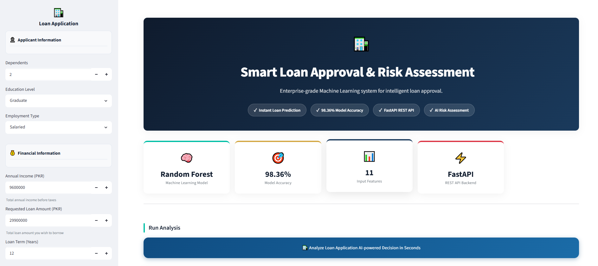
</p>

---

## ✅ Approved Loan Prediction

When the applicant satisfies the approval criteria, the system displays a detailed AI Decision Report including prediction confidence, risk level, and recommendation.

<p align="center">
    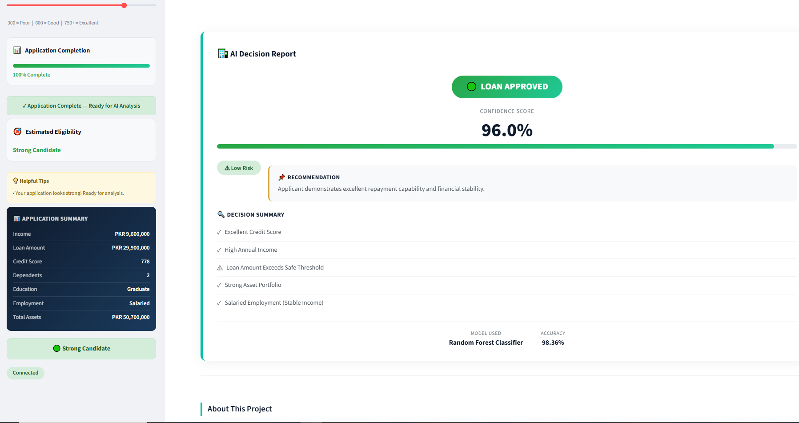
</p>

---

## ❌ Rejected Loan Prediction

For high-risk applicants, the application explains the decision with confidence score, risk assessment, and actionable recommendations.

<p align="center">
    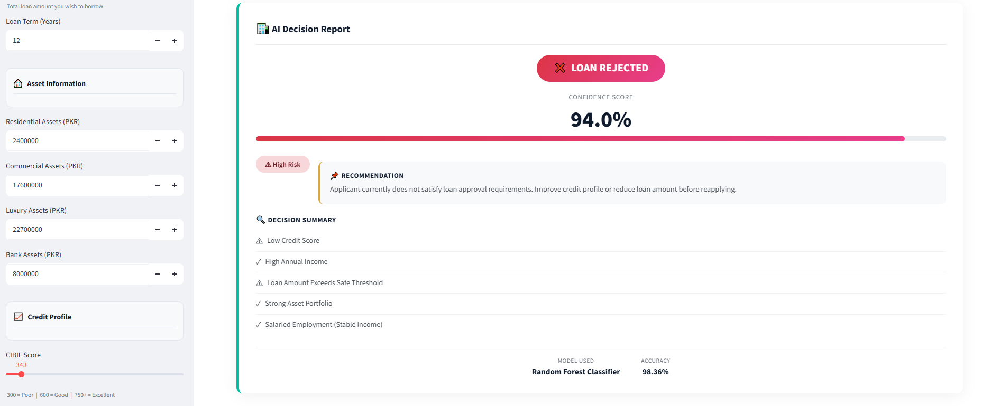
</p>

---

## ℹ️ About the Project

The About section explains the project architecture, machine learning model, technology stack, and development approach.

<p align="center">
    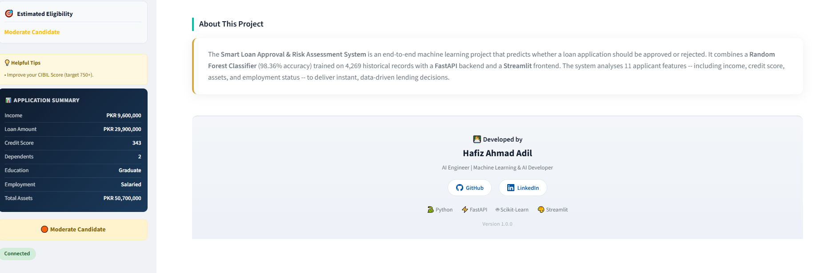
</p>

---

# 📊 Exploratory Data Analysis (EDA)

Understanding the dataset was an essential step before model training. The following visualizations were created during Exploratory Data Analysis.

---

## Loan Status Distribution

<p align="center">
    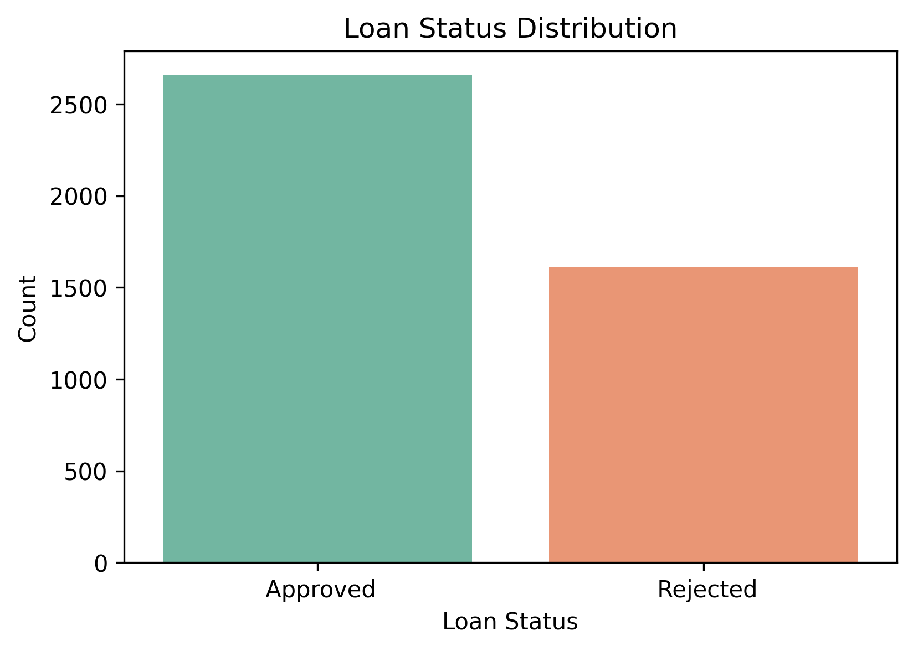
</p>

---

## Categorical Feature Distribution

<p align="center">
    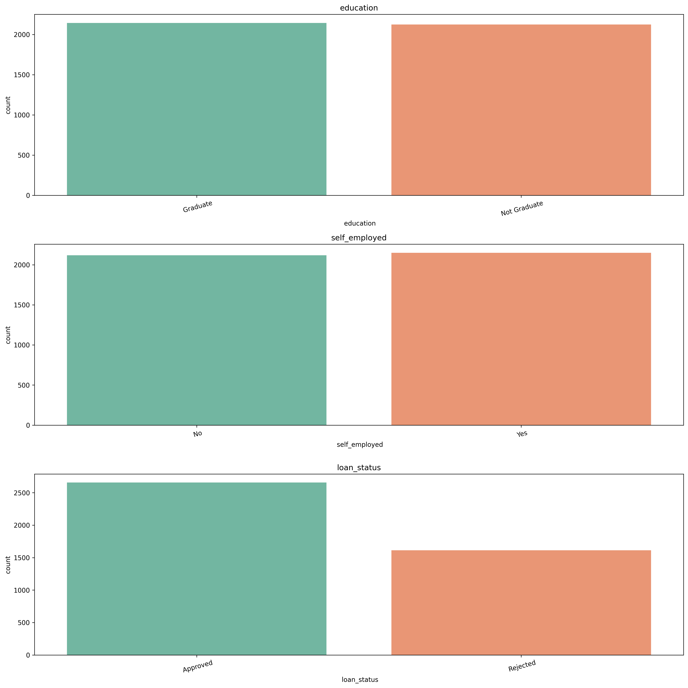
</p>

---

## Education vs Loan Status

<p align="center">
    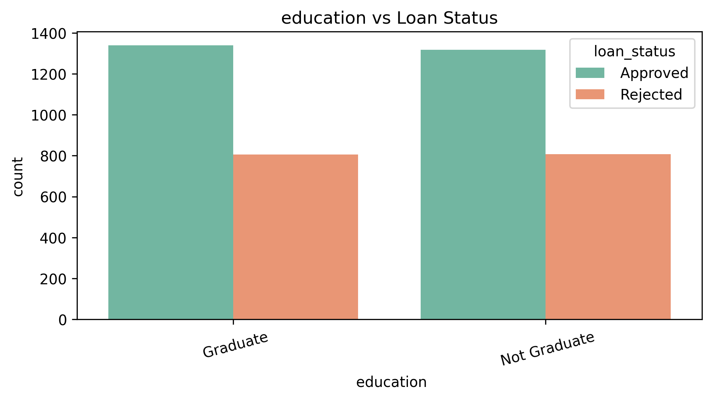
</p>

---

## Self Employed vs Loan Status

<p align="center">
    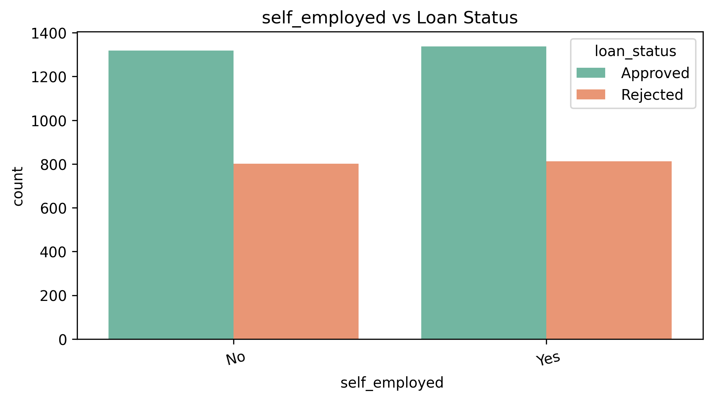
</p>

---

## Distribution of Numerical Features

<p align="center">
    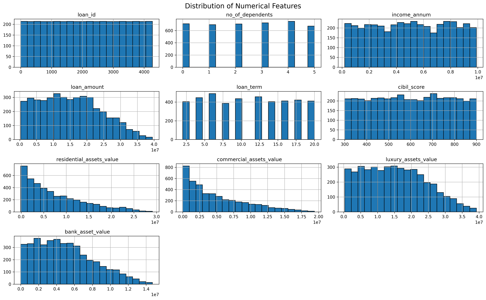
</p>

---

## Correlation Heatmap

The heatmap highlights relationships among numerical features, helping identify important correlations used during feature analysis.

<p align="center">
    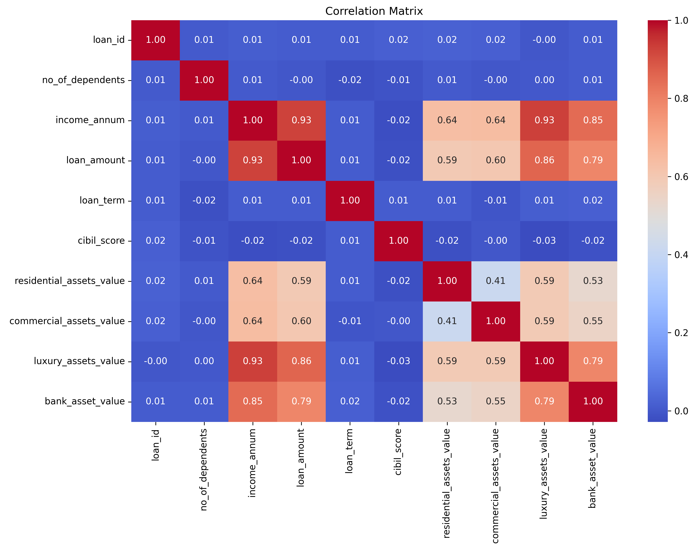
</p>

---

## Boxplots

Boxplots were used to inspect feature distributions and identify potential outliers.

<p align="center">
    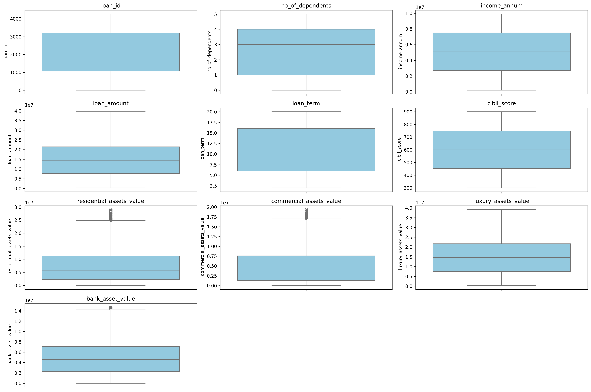
</p>

---

# 🤖 Model Evaluation

The Random Forest Classifier demonstrated excellent predictive performance on the testing dataset.

## Confusion Matrix

<p align="center">
    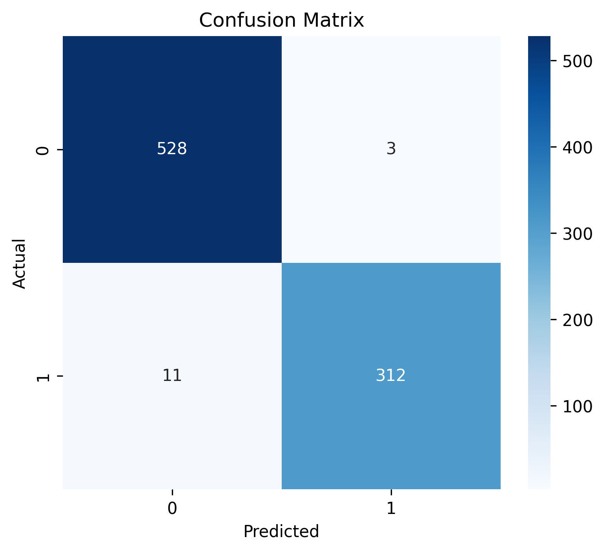
</p>

The confusion matrix confirms that the model correctly classified the majority of loan applications, achieving an overall accuracy of **98.36%** with very few misclassifications.

---

# ⚡ FastAPI REST API

The application uses **FastAPI** to serve the trained Machine Learning model through RESTful APIs. The frontend communicates with the backend using HTTP requests, creating a production-style architecture.

---

## Available Endpoints

| Method | Endpoint | Description |
|---------|----------|-------------|
| GET | `/` | API Information |
| GET | `/health` | Health Check |
| POST | `/predict` | Loan Approval Prediction |

---

## Swagger Documentation

FastAPI automatically generates interactive API documentation.

```
http://127.0.0.1:8000/docs
```

<p align="center">
    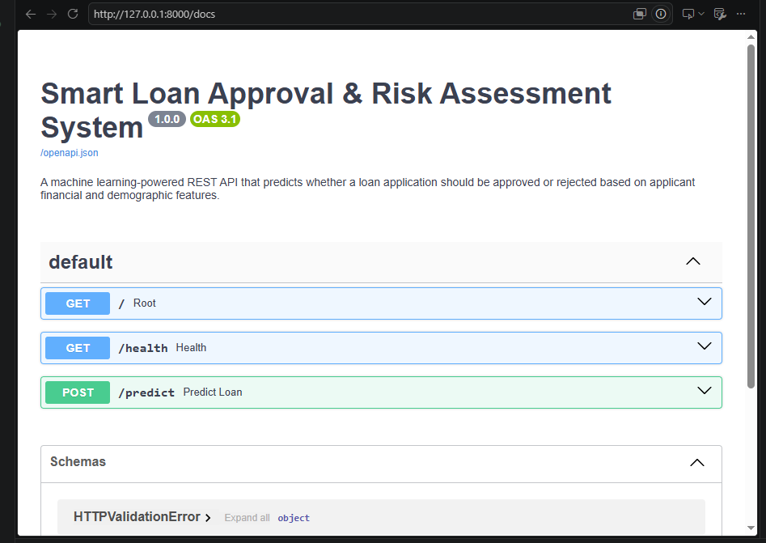
</p>

---

## Sample Prediction Request

```json
{
  "no_of_dependents": 2,
  "education": 0,
  "self_employed": 0,
  "income_annum": 9600000,
  "loan_amount": 29900000,
  "loan_term": 12,
  "cibil_score": 778,
  "residential_assets_value": 2400000,
  "commercial_assets_value": 17600000,
  "luxury_assets_value": 22700000,
  "bank_asset_value": 8000000
}
```

---

## Sample Response

```json
{
  "prediction": "Approved",
  "probability": 0.96
}
```

---

# 🚀 Installation

## 1. Clone Repository

```bash
git clone https://github.com/hafizahmadadilaiengineer/machine-learning-projects.git

cd machine-learning-projects
```

---

# ⚙ Backend Setup

Navigate to the backend folder:

```bash
cd 05-smart-loan-approval-system/backend
```

Install dependencies:

```bash
pip install -r requirements.txt
```

Run the FastAPI server:

```bash
python -m uvicorn api:app --reload
```

Backend URL:

```
http://127.0.0.1:8000
```

Swagger Documentation:

```
http://127.0.0.1:8000/docs
```

---

# 🎨 Frontend Setup

Navigate to the frontend folder:

```bash
cd ../frontend
```

Install dependencies:

```bash
pip install -r requirements.txt
```

Run the Streamlit application:

```bash
streamlit run app.py
```

Frontend URL:

```
http://localhost:8501
```

---

# 🔄 Application Workflow

```text
User

   │

   ▼

Streamlit Dashboard

   │

   ▼

FastAPI REST API

   │

   ▼

Random Forest Classifier

   │

   ▼

Prediction

   │

   ▼

AI Decision Report
```

---

# 📈 Future Improvements

This project can be extended with several production-ready features:

- 🐳 Docker & Docker Compose
- ☁️ Cloud Deployment (Render + Streamlit Cloud)
- 🔐 User Authentication (JWT)
- 🗄 Database Integration (PostgreSQL / MySQL)
- 📜 Prediction History
- 📊 SHAP Explainability
- 🤖 XGBoost Model Comparison
- 📈 Model Monitoring
- 📡 CI/CD Pipeline using GitHub Actions
- 🧪 Automated Testing
- 📱 Mobile-Friendly Dashboard
- 🌍 Multi-language Support

---

# 💼 Skills Demonstrated

This project showcases the following skills:

- Machine Learning
- Classification
- Data Analysis
- Exploratory Data Analysis
- Feature Engineering
- Data Preprocessing
- Model Evaluation
- FastAPI
- REST API Development
- Pydantic Validation
- Streamlit
- Modular Python Development
- Software Architecture
- Git & GitHub
- Model Deployment Preparation

---
## Live Demo

Frontend:
https://hafiz-smart-loan-approval-system-2026.streamlit.app/

Backend API:
https://loan-approval-api-lr4z.onrender.com

Swagger Documentation:
https://loan-approval-api-lr4z.onrender.com/docs

# 👨‍💻 Author

<div align="center">

## Hafiz Ahmad Adil

**AI Engineer | Machine Learning Engineer | Python Developer**

📧 **Portfolio Project**

### Connect with Me

<a href="https://github.com/hafizahmadadilaiengineer" target="_blank">

</a>

<a href="https://www.linkedin.com/in/hafizahmadadildurrani" target="_blank">

</a>

</div>

---

# 📄 License

This project is licensed under the **MIT License**.

You are free to use, modify, and distribute this project for educational and learning purposes.

---

<div align="center">

## ⭐ If you found this project useful, please consider giving it a Star ⭐

It motivates me to continue building high-quality AI and Machine Learning projects.

---

### 🚀 Built with Python, FastAPI, Streamlit & Machine Learning

**Project Status:** ✅ Completed

**Difficulty Level:** Intermediate → Advanced

**Project Type:** Portfolio Project

**Version:** 1.0.0

Made with ❤️ by **Hafiz Ahmad Adil**

</div>
