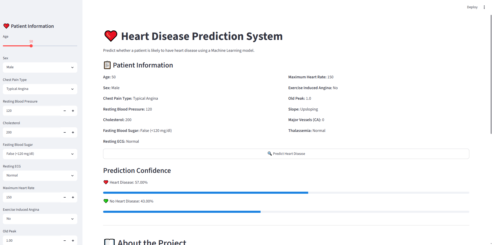

# 🚀 Machine Learning Projects Portfolio

Welcome to my Machine Learning Projects portfolio.

This repository contains end-to-end Machine Learning projects built using **Python**, **Scikit-Learn**, **Pandas**, **NumPy**, and **Streamlit**.

---

# 👨‍💻 About Me

**Hafiz Ahmad Adil**

- 🎓 MS Computer Science
- 🤖 Aspiring AI Engineer
- 💻 Python & Machine Learning Enthusiast

---

# 📂 Projects

## 🏠 01. House Price Prediction

### Description

Predict house prices using Linear Regression.

### Technologies

- Python
- Pandas
- NumPy
- Scikit-Learn
- Streamlit

---

## 🎓 02. Student Performance Prediction

### Description

Predict students' Math scores using demographic information and academic performance.

### Technologies

- Python
- Pandas
- NumPy
- Scikit-Learn
- Streamlit

---

## 🚧 Upcoming Projects

- ❤️ Heart Disease Prediction
- 💳 Loan Approval Prediction
- 🚗 Car Price Prediction
- 🧠 Customer Churn Prediction
- 📧 Email Spam Detection
- 🎬 Movie Recommendation System
- 🤖 RAG Chatbot
- 📄 Resume Screening System

---

# 🛠️ Tech Stack

- Python
- Pandas
- NumPy
- Matplotlib
- Seaborn
- Scikit-Learn
- Streamlit
- Git
- GitHub

---

### ❤️ Project 3 — Heart Disease Prediction System

Predict whether a patient is likely to have heart disease using Machine Learning.

**Features**
- End-to-End ML Pipeline
- Data Preprocessing
- Random Forest Classifier
- Streamlit Web App
- Prediction Confidence
- Professional UI

📂 Folder: `03-heart-disease-prediction`

🚀 Live Demo: *(Add after deployment)*

📸 Preview:

# 🌐 Connect With Me

**GitHub**

https://github.com/hafizahmadadilaiengineer

**LinkedIn**

https://www.linkedin.com/in/hafizahmadadildurrani

---

⭐ Thank you for visiting my Machine Learning Portfolio.