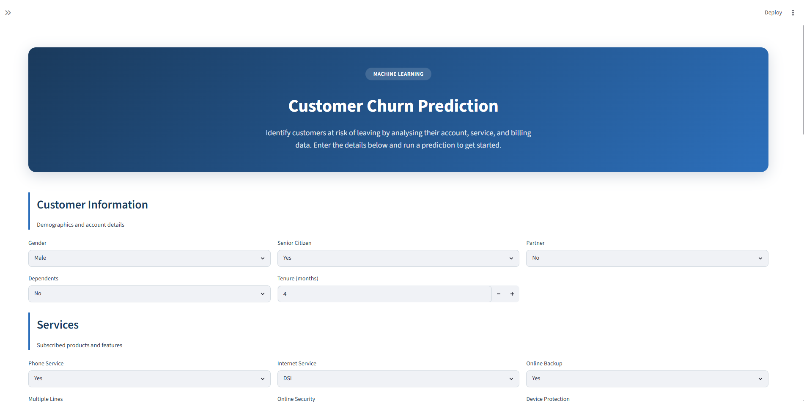

# 🚀 Machine Learning Projects Portfolio

Welcome to my Machine Learning Projects portfolio.

This repository contains end-to-end Machine Learning projects built using **Python**, **Scikit-Learn**, **Pandas**, **NumPy**, and **Streamlit**. Each project follows a complete machine learning workflow, from data exploration to deployment.

---

# 👨‍💻 About Me

**Hafiz Ahmad Adil**

- 🎓 MS Computer Science
- 🤖 Aspiring AI Engineer
- 💻 Python & Machine Learning Enthusiast
- 👨‍🏫 IT Instructor
- 📚 Founder of Learn with Adil

---

# 📂 Projects

## 🏠 01. House Price Prediction

### Description

Predict house prices using **Linear Regression**.

### Technologies

- Python
- Pandas
- NumPy
- Scikit-Learn
- Streamlit

📂 Folder: `01-house-price-prediction`

---

## 🎓 02. Student Performance Prediction

### Description

Predict students' Math scores using demographic and academic information.

### Technologies

- Python
- Pandas
- NumPy
- Scikit-Learn
- Streamlit

📂 Folder: `02-student-performance-prediction`

---

## ❤️ 03. Heart Disease Prediction System

### Description

Predict whether a patient is likely to have heart disease using Machine Learning.

### Features

- End-to-End ML Pipeline
- Data Preprocessing
- Random Forest Classifier
- Streamlit Web Application
- Prediction Confidence
- Professional UI

📂 Folder: `03-heart-disease-prediction`

🚀 Live Demo: *(https://hafiz-heart-disease-prediction-2026.streamlit.app/)*

📸 Preview

---

## 📞 04. Customer Churn Prediction System

### Description

Predict whether a telecom customer is likely to churn using Machine Learning.

### Features

- End-to-End ML Pipeline
- Business-Oriented Dashboard
- Gradient Boosting Classifier
- Customer Risk Prediction
- Prediction Confidence
- Business Recommendations
- Modern Streamlit UI

📂 Folder: `04-customer-churn-prediction`

🚀 Live Demo: *(https://hafiz-customer-churn-prediction-2026.streamlit.app/)*

📸 Preview

---

# 🚧 Upcoming Projects

- 🏦 Loan Approval Prediction
- 🚗 Car Price Prediction
- 🏠 House Rent Prediction
- 🧠 Parkinson Disease Prediction
- 💳 Credit Card Fraud Detection
- 👨‍💼 Employee Attrition Prediction
- 🏥 Diabetes Prediction
- 🎬 Movie Recommendation System
- 🤖 RAG Chatbot
- 📄 Resume Screening System

---

# 🛠️ Tech Stack

### Programming

- Python

### Machine Learning

- Scikit-Learn
- Pandas
- NumPy

### Data Visualization

- Matplotlib
- Seaborn

### Deployment

- Streamlit

### Version Control

- Git
- GitHub

---

# 📊 Machine Learning Workflow

Every project in this repository follows a consistent workflow:

- Exploratory Data Analysis (EDA)
- Data Preprocessing
- Model Training
- Model Evaluation
- Model Selection
- Model Saving
- Prediction Script
- Streamlit Deployment

---

# 📈 Portfolio Progress

| Category | Count |
|-----------|------:|
| Regression Projects | 2 |
| Classification Projects | 2 |
| Total Projects | **4** |
| Streamlit Applications | **4** |

---

# 🌐 Connect With Me

### GitHub

https://github.com/hafizahmadadilaiengineer

### LinkedIn

https://www.linkedin.com/in/hafizahmadadildurrani

---

⭐ **Thank you for visiting my Machine Learning Portfolio!**

If you find these projects useful, consider giving this repository a ⭐ on GitHub.